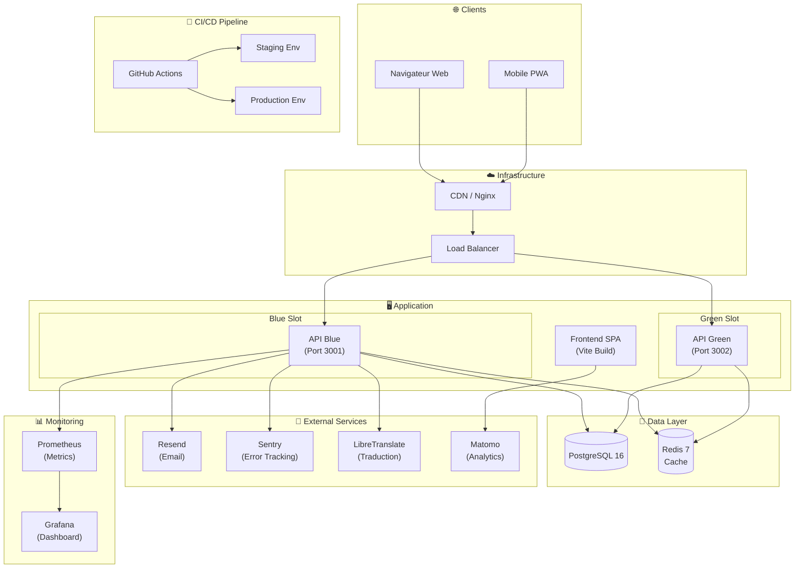
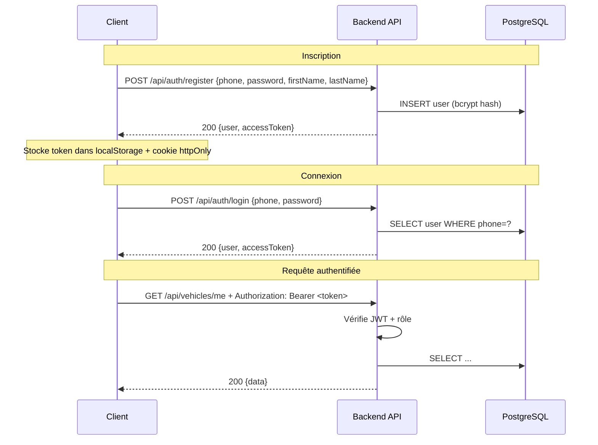
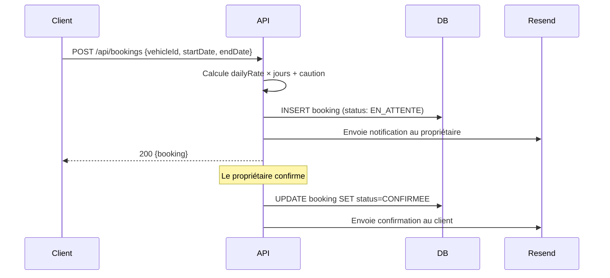
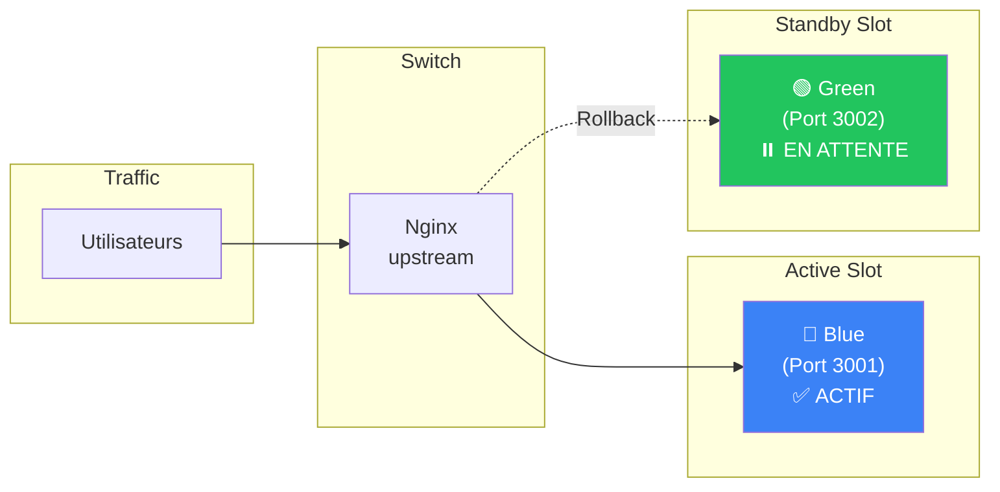
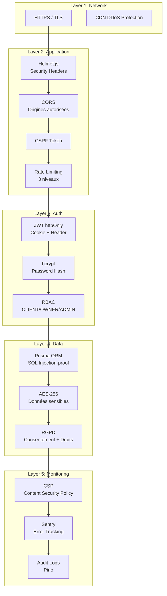

# Architecture Technique — Carguinée

## Vue d'ensemble

```mermaid
graph TB
    subgraph "🌐 Clients"
        Browser["Navigateur Web"]
        Mobile["Mobile PWA"]
    end

    subgraph "☁️ Infrastructure"
        CDN["CDN / Nginx"]
        LB["Load Balancer"]
    end

    subgraph "🔄 CI/CD Pipeline"
        GH["GitHub Actions"]
        Staging["Staging Env"]
        Prod["Production Env"]
    end

    subgraph "🖥️ Application"
        subgraph "Blue Slot"
            API_Blue["API Blue\n(Port 3001)"]
        end
        subgraph "Green Slot"
            API_Green["API Green\n(Port 3002)"]
        end
        Frontend["Frontend SPA\n(Vite Build)"]
    end

    subgraph "💾 Data Layer"
        PG[(PostgreSQL 16)]
        Redis[(Redis 7\nCache)]
    end

    subgraph "🔌 External Services"
        Resend["Resend\n(Email)"]
        Sentry["Sentry\n(Error Tracking)"]
        LT["LibreTranslate\n(Traduction)"]
        Matomo["Matomo\n(Analytics)"]
    end

    subgraph "📊 Monitoring"
        Prometheus["Prometheus\n(Metrics)"]
        Grafana["Grafana\n(Dashboard)"]
    end

    Browser --> CDN
    Mobile --> CDN
    CDN --> LB
    LB --> API_Blue
    LB --> API_Green
    API_Blue --> PG
    API_Blue --> Redis
    API_Green --> PG
    API_Green --> Redis
    API_Blue --> Resend
    API_Blue --> Sentry
    API_Blue --> LT
    Frontend --> Matomo
    API_Blue --> Prometheus
    Prometheus --> Grafana
    GH --> Staging
    GH --> Prod
```

## Flux d'authentification

```mermaid
sequenceDiagram
    participant C as Client
    participant API as Backend API
    participant DB as PostgreSQL

    Note over C,DB: Inscription
    C->>API: POST /api/auth/register {phone, password, firstName, lastName}
    API->>DB: INSERT user (bcrypt hash)
    API-->>C: 200 {user, accessToken}
    Note over C: Stocke token dans localStorage + cookie httpOnly

    Note over C,DB: Connexion
    C->>API: POST /api/auth/login {phone, password}
    API->>DB: SELECT user WHERE phone=?
    API-->>C: 200 {user, accessToken}

    Note over C,DB: Requête authentifiée
    C->>API: GET /api/vehicles/me + Authorization: Bearer <token>
    API->>API: Vérifie JWT + rôle
    API->>DB: SELECT ...
    API-->>C: 200 {data}
```

## Flux de réservation

```mermaid
sequenceDiagram
    participant Client
    participant API
    participant DB
    participant Email as Resend

    Client->>API: POST /api/bookings {vehicleId, startDate, endDate}
    API->>API: Calcule dailyRate × jours + caution
    API->>DB: INSERT booking (status: EN_ATTENTE)
    API->>Email: Envoie notification au propriétaire
    API-->>Client: 200 {booking}

    Note over API: Le propriétaire confirme
    API->>DB: UPDATE booking SET status=CONFIRMEE
    API->>Email: Envoie confirmation au client
```

## Blue-Green Deployment

```mermaid
graph LR
    subgraph "Traffic"
        Users["Utilisateurs"]
    end

    subgraph "Active Slot"
        Blue["🔵 Blue\n(Port 3001)\n✅ ACTIF"]
    end

    subgraph "Standby Slot"
        Green["🟢 Green\n(Port 3002)\n⏸️ EN ATTENTE"]
    end

    subgraph "Switch"
        Nginx["Nginx\nupstream"]
    end

    Users --> Nginx
    Nginx --> Blue
    Nginx -.->|"Rollback"| Green

    style Blue fill:#3b82f6,color:#fff
    style Green fill:#22c55e,color:#fff
```

## Sécurité — Couches de protection

```mermaid
graph TB
    subgraph "Layer 1: Network"
        HTTPS["HTTPS / TLS"]
        CDN_L["CDN DDoS Protection"]
    end

    subgraph "Layer 2: Application"
        Helmet["Helmet.js\nSecurity Headers"]
        CORS["CORS\nOrigines autorisées"]
        CSRF["CSRF Token"]
        RateLimit["Rate Limiting\n3 niveaux"]
    end

    subgraph "Layer 3: Auth"
        JWT["JWT httpOnly\nCookie + Header"]
        Bcrypt["bcrypt\nPassword Hash"]
        Roles["RBAC\nCLIENT/OWNER/ADMIN"]
    end

    subgraph "Layer 4: Data"
        Prisma["Prisma ORM\nSQL Injection-proof"]
        Encrypt["AES-256\nDonnées sensibles"]
        RGPD["RGPD\nConsentement + Droits"]
    end

    subgraph "Layer 5: Monitoring"
        CSP["CSP\nContent Security Policy"]
        Sentry2["Sentry\nError Tracking"]
        AuditLog["Audit Logs\nPino"]
    end

    HTTPS --> Helmet --> CORS --> CSRF --> RateLimit
    RateLimit --> JWT --> Bcrypt --> Roles
    Roles --> Prisma --> Encrypt --> RGPD
    RGPD --> CSP --> Sentry2 --> AuditLog
```
