# Diagramme Entité-Relation (ERD) — Carguinée

## Schéma de la base de données

```mermaid
erDiagram
    User ||--o{ Vehicle : owns
    User ||--o{ RentalBooking : rents
    User ||--o{ Review : writes
    User ||--o{ Favorite : saves
    User ||--o{ Notification : receives
    User ||--o{ Conversation : participates
    User ||--o{ OwnerRequest : submits
    User ||--o{ Report : creates
    User ||--o{ ReactivationRequest : requests
    User ||--o{ PasswordReset : requests

    Vehicle ||--o{ VehiclePhoto : has
    Vehicle ||--o{ RentalBooking : booked
    Vehicle ||--o{ Review : reviewed
    Vehicle ||--o{ Favorite : favorited
    Vehicle ||--o{ VehicleConditionReport : condition
    Vehicle ||--o{ SaleListing : listed
    Vehicle }o--|| User : owned_by

    RentalBooking }o--|| Vehicle : for_vehicle
    RentalBooking }o--o| User : customer
    RentalBooking ||--o| RentalContract : has_contract

    Conversation ||--o{ Message : contains
    Conversation }o--o| User : participant1
    Conversation }o--o| User : participant2
    Message }o--|| User : sender

    User {
        uuid id PK
        string phone UK
        string email
        string firstName
        string lastName
        enum role "CLIENT | PROPRIETAIRE | ADMIN"
        boolean isActive
        boolean isBanned
        boolean isPhoneVerified
        float averageRating
        boolean identityVerified
        datetime createdAt
        datetime updatedAt
    }

    Vehicle {
        uuid id PK
        uuid ownerId FK
        string brand
        string model
        enum type "VehicleType"
        enum condition "NEUF | OCCASION"
        int year
        int mileageKm
        string color
        int seats
        string commune
        string quartier
        string secteur
        boolean supportsRental
        boolean supportsSale
        decimal dailyRentalPriceGnf
        decimal salePriceGnf
        enum publicationStatus "PublicationStatus"
        string descriptionFr
        string descriptionEn
        float latitude
        float longitude
        datetime createdAt
        datetime updatedAt
    }

    VehiclePhoto {
        uuid id PK
        uuid vehicleId FK
        string url
        int sortOrder
        datetime createdAt
    }

    RentalBooking {
        uuid id PK
        uuid vehicleId FK
        uuid customerId FK
        date startDate
        date endDate
        decimal dailyRateGnf
        decimal totalAmountGnf
        decimal depositAmountGnf
        enum depositStatus "HELD | RETURNED | FORFEITED"
        enum status "BookingStatus"
        string notes
        datetime createdAt
        datetime updatedAt
    }

    Review {
        uuid id PK
        uuid vehicleId FK
        uuid reviewerId FK
        uuid bookingId FK
        int rating "1-5"
        string comment
        datetime createdAt
    }

    Favorite {
        uuid id PK
        uuid userId FK
        uuid vehicleId FK
        datetime createdAt
    }

    Notification {
        uuid id PK
        uuid userId FK
        enum type "BOOKING | MESSAGE | SYSTEM"
        string title
        string message
        boolean isRead
        string link
        datetime createdAt
    }

    Conversation {
        uuid id PK
        uuid participant1Id FK
        uuid participant2Id FK
        uuid vehicleId FK
        datetime lastMessageAt
        datetime createdAt
    }

    Message {
        uuid id PK
        uuid conversationId FK
        uuid senderId FK
        string content
        boolean isRead
        datetime sentAt
        datetime editedAt
        datetime deletedAt
    }

    Report {
        uuid id PK
        uuid reporterId FK
        enum targetType "USER | VEHICLE | MESSAGE | REVIEW"
        uuid targetId
        string reason
        string description
        enum status "PENDING | REVIEWED | DISMISSED"
        uuid reviewedById FK
        string resolution
        datetime createdAt
    }

    ReactivationRequest {
        uuid id PK
        uuid userId FK
        string phone
        string firstName
        string lastName
        string reason
        enum status "PENDING | APPROVED | REJECTED"
        uuid reviewedById FK
        string rejectionReason
        datetime reviewedAt
        datetime createdAt
    }

    OwnerRequest {
        uuid id PK
        uuid applicantId FK
        string phone
        string businessName
        string reason
        enum status "PENDING | APPROVED | REJECTED"
        uuid reviewerId FK
        string rejectionReason
        datetime reviewedAt
        datetime createdAt
    }

    SaleListing {
        uuid id PK
        uuid vehicleId FK
        decimal priceGnf
        enum status "ACTIVE | SOLD | EXPIRED"
        datetime expiresAt
        datetime createdAt
    }

    VehicleConditionReport {
        uuid id PK
        uuid vehicleId FK
        string exteriorDamage
        string paintQuality
        string engineCondition
        string transmissionCondition
        string tireCondition
        string brakeCondition
        string interiorCondition
        int overallRating
        datetime createdAt
    }

    RentalContract {
        uuid id PK
        uuid bookingId FK
        string content
        boolean signedByOwner
        boolean signedByCustomer
        datetime createdAt
    }

    PasswordReset {
        uuid id PK
        uuid userId FK
        string token
        datetime expiresAt
        boolean used
        datetime createdAt
    }
```

## Résumé des relations

| Relation | Type | Description |
|----------|------|-------------|
| User → Vehicle | 1:N | Un propriétaire a plusieurs véhicules |
| Vehicle → RentalBooking | 1:N | Un véhicule a plusieurs réservations |
| User → RentalBooking | 1:N | Un client a plusieurs réservations |
| Vehicle → Review | 1:N | Un véhicule a plusieurs avis |
| User → Review | 1:N | Un utilisateur écrit plusieurs avis |
| User → Favorite | 1:N | Un utilisateur a plusieurs favoris |
| Conversation → Message | 1:N | Une conversation contient plusieurs messages |
| User → Conversation | 1:N | Un utilisateur participe à plusieurs conversations |
| User → Report | 1:N | Un utilisateur crée plusieurs signalements |
| User → ReactivationRequest | 1:N | Un utilisateur soumet plusieurs demandes |
